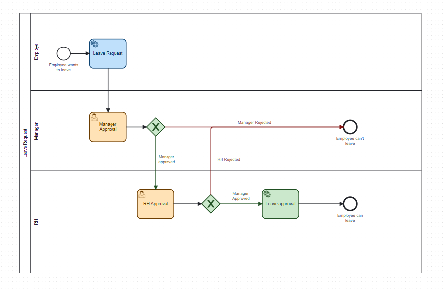
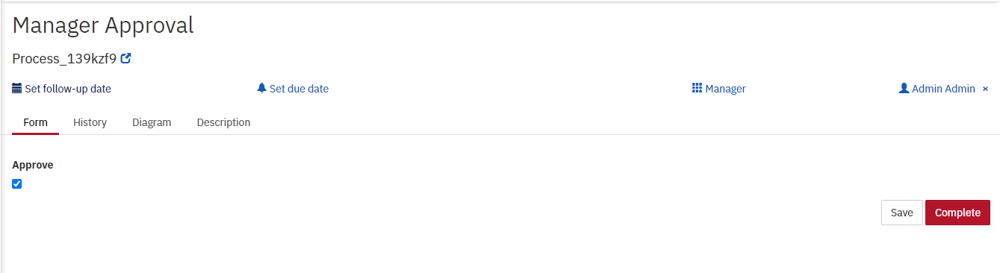
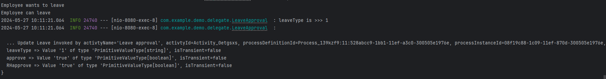

<h1 align="center">
Camunda Demo</h1>

## 🧐 Description 
Cette démonstration a pour but de montrer ma compréhension de Camunda. Il s'agit du processus lorsqu'un employé souhaite partir. Il envoie une demande au serveur, puis obtient l'approbation de son manager et ensuite celle des ressources humaines (RH). Enfin, son départ est mis à jour dans le système pour indiquer qu'il peut partir. Pour cela, un schéma a été réalisé comprenant deux tâches système : l'une montrant que l'employé souhaite partir, une tâche utilisateur où la demande doit être approuvée par le manager via un formulaire, puis par les RH, et enfin une tâche système indiquant qu'il peut partir maintenant. Nous pouvons également insérer des variables pour travailler avec notre système.
## 🎯 Project Goals 
Les objectifs principaux du projet incluent : la création et le déploiement d'un modèle de processus, la liaison du schéma de processus avec le système backend et la manipulation des données selon les besoins.

## 📝 Schema 

  

## 📝 Camunda cockpit 

  

## 📝 Camunda Tasklist 

  

## 📝 User Task 

  

## 🛠️ Execution 

  

🚀 Installation 

   - Clonez le dépôt.
   - Ouvrez le projet dans IntelliJ IDEA.
   - Utilisez les identifiants username:admin , password:admin
   - Exécutez la commande Mvn clean install
   - Exécutez l'application.
   - Accédez à Camunda tableau de bord à l'adresse http://localhost:8080.
